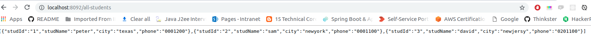
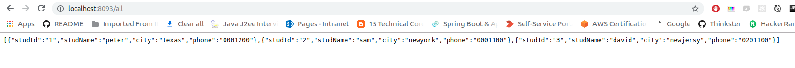
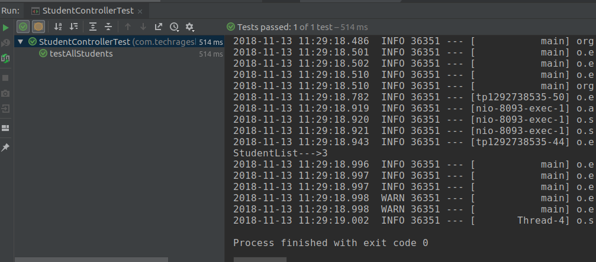

# springboot-wiremock-demo
This project explains how to use wiremock in springboot

## WireMock

> Mock your APIs for fast, robust and comprehensive testing
WireMock is a simulator for HTTP-based APIs. Some might consider it a service virtualization tool or a mock server.

> It enables you to stay productive when an API you depend on doesn't exist or isn't complete. It supports testing of edge cases and failure modes that the real API won't reliably produce. And because it's fast it can reduce your build time from hours down to minutes.

Refer : http://wiremock.org/


Let assume, you are using some external service which is not ready yet. Its still in development. But the external service team shared the request and response to you for the respective service.

You dont need to wait for the external service to make your development complete. You can create a mock api using wiremock based on the given response which they provided.

It will be helpful when you run integration test.

Hereby I have shared the example for the wiremock with springboot.


**Application Demo:**

_**Application 1:**_

I have created the simple rest service application which return list of students 

**Application Name: rest-service-demo**

**Output**:



Note: (Assume this an external service)


**_Application 2:_**

I have created the client application which consumes the rest service (external one)

**_Scenario 1:_**

Assume the external rest service is ready for use. 

**Screenshot:**


Scenario 2:

Assume the external rest service is not ready but we have a sample response. 
Using wiremock, we can continue our development and do integration testing.

1. **pom.xml** (Added wiremock dependency)

```
<dependency>
    <groupId>com.github.tomakehurst</groupId>
	<artifactId>wiremock</artifactId>
	<version>2.19.0</version>
	<scope>test</scope>
</dependency>

```

2. **StudentControllerTest.java**

```
@RunWith(SpringRunner.class)
@AutoConfigureMockMvc
@SpringBootTest(classes = RestClientDemoApplication.class, webEnvironment = SpringBootTest.WebEnvironment.DEFINED_PORT)
@ActiveProfiles(value = "integration")
public class StudentControllerTest {

    @Rule
    public WireMockRule wireMockRule = new WireMockRule(9998);

    @Autowired
    private TestRestTemplate testRestTemplate;

    @Before
    public void setUp() {
        mockRemoteService();
    }

    @Test
    public void testAllStudents() {
        ResponseEntity<List<Student>> responseEntity = testRestTemplate.exchange("http://localhost:8093/all", HttpMethod.GET,null,
                new ParameterizedTypeReference<List<Student>>(){}
        );
        List<Student> studentList = responseEntity.getBody();
        System.out.println("StudentList--->" + studentList.size());
    }

    private void mockRemoteService() {
        stubFor(get(urlEqualTo("/all-students"))
                .willReturn(aResponse()
                        .withStatus(200)
                        .withHeader("Content-Type", "application/json")
                        .withBodyFile("response.json")
                ));
    }
}

```

3. Used application-integration.properties for integration testing

```
remote.url=http://localhost:9998/all-students
server.port=8093

```

4. Created Sample response.json in test resource folder for mock

**response.json**

```
[
  {
    "studId": "1",
    "studName": "peter",
    "city": "texas",
    "phone": "0001200"
  },
  {
    "studId": "2",
    "studName": "sam",
    "city": "newyork",
    "phone": "0001100"
  },
  {
    "studId": "3",
    "studName": "david",
    "city": "newjersy",
    "phone": "0201100"
  }
]

```
Note: We need to keep files under **_files** folder


5. Stop the rest-service-demo application

6. Stop the rest-client-demo application

7. Run the integration test **StudentControllerTest.java**

8. **Screenshot:**




### Happy Coding